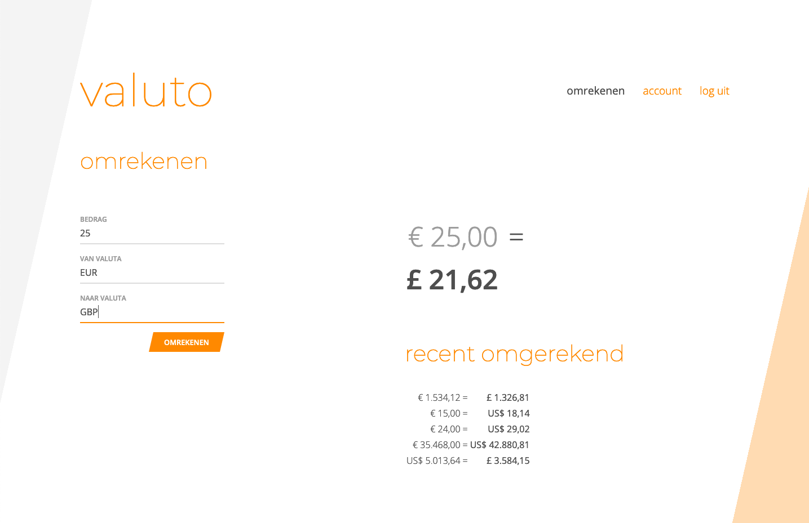

# Valuto

Currency converter app based on Laravel and Vue.js. A one day example project.
See ['Possible Improvements'](#possible-improvements) for ways to make this
*even* better.  

## Setup

    $ ./setup.sh

    # Or manually:

    $ cd backend
    $ composer install
    $ cp .env.example .env
    $ php artisan key:generate
    $ echo > database/database.sqlite
    $ php artisan migrate:fresh

    $ cd frontend
    $ npm install

## Laravel Backend

The backend uses Laravel Sanctum for authentication. The backend requires an API
key for the free.currencyconverterapi.com API. This key needs to be set in
`/backend/.env` under `API_KEY_FCCA=[API_KEY_HERE]`.  

### Requirements:

* PHP ^7.4|^8.0  
* Composer  
* NPM  

### Run backend

    $ cd backend
    $ php artisan serve --host=localhost --port=8000

## Vue.js Frontend

The frontend uses Vuex for state management and the Axios HTTP client. The
frontend expects the backend to run at `http://localhost:8000`. Otherwise set
the `VUE_APP_API` value in `/frontend/.env`.  

### Run frontend

    $ cd frontend
    $ npm run serve

### Buid frontend for production

    $ npm run build

## Possible improvements

* Account for the times at which new rates are being published. Currently the
  exchange rates are saved in the database to limit the amount of API calls
  necessary. This only accounts for the current day (CET) and could result in
  two days having the same rate.  
* Retrieve list of currencies from API's. This would allow the user to select
  them instead of manually entering the three letter codes.  
* Account for the fact that each API in use offers a different set of
  currencies. This could limit the amount of requests necessary and could even
  provide a way to calculate rates between different API's.  
* Frontend validation before sending requests.  
* Block access to pages only for (un)authenticated users in the frontend. The
  API does verify authentication by Laravel Sanctum.  
* Colors and line thicknesses can be improved from an accessibility standpoint.  
